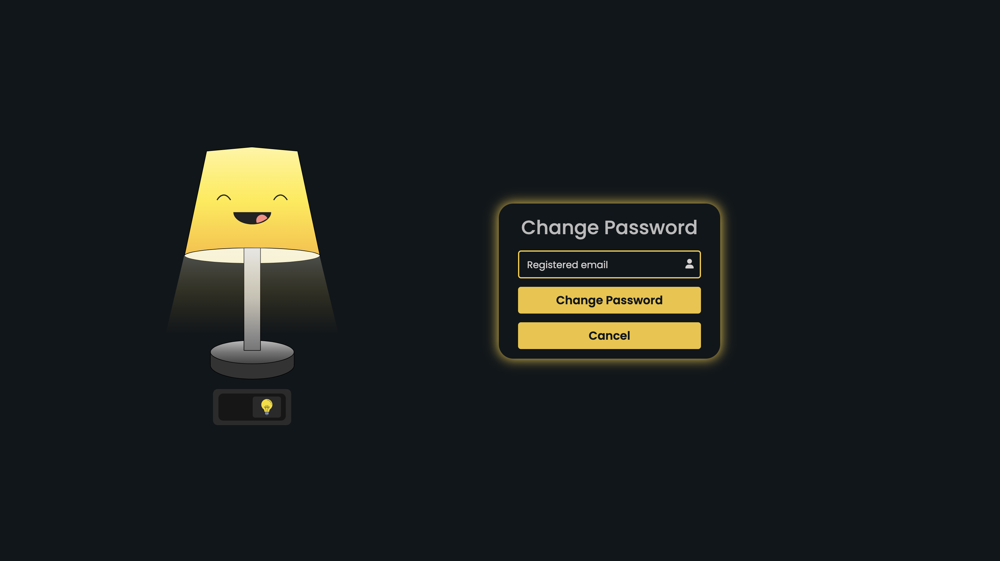

  

# Interactive Lamp Login System

An interactive authentication UI with a lamp-based animation that reveals login and signup forms with smooth transitions.

Includes Login, Signup, and Forgot Password features with floating labels and clean design.
Connected to a backend that enables account creation, login/logout, password reset, and secure authentication handling.

---

## Features

- Lamp toggle animation to show/hide login
- Login and signup forms with floating inputs
- Forgot & change password functionality
- Responsive and minimal UI
- Smooth transitions
- Input reset support
- Custom 500 server error page

---

## Technologies Used

- **HTML**
- **CSS**
- **JavaScript**
- **Font Awesome Icons**

---

## Authentication Module

- Login
- Sign Up
- Forgot Password
- Change Password
- Log out

---

## Preview

  
  

  
  

  
  

  

